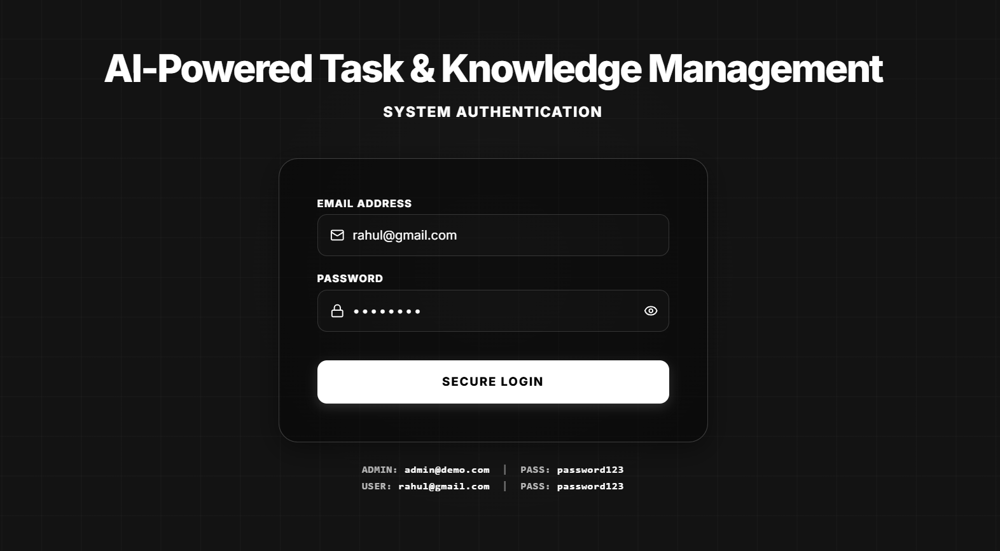
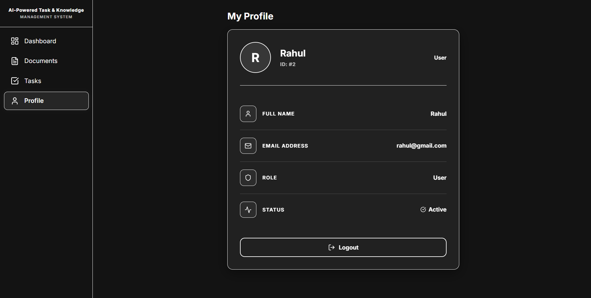

# ✦ AI-Powered Task & Knowledge Management System

<div align="center">
  
  
  
  
  
</div>

<br />

A sophisticated, full-stack MVP designed to merge intelligent knowledge retrieval with efficient task management. Featuring **Role-Based Access Control (RBAC)**, **FAISS Semantic Search**, **Document Processing**, and **Real-Time Analytics**.

---

## ❖ Tech Stack

### Backend Infrastructure
- **Framework:** FastAPI (Python)
- **Database:** MySQL 8.0+ / SQLAlchemy ORM
- **Authentication:** JWT (python-jose) + bcrypt
- **AI Integration:** sentence-transformers (all-MiniLM-L6-v2) + FAISS Vector Store
- **File Parsing:** PyMuPDF (PDF), built-in TXT handling

### Frontend Architecture
- **Framework:** React.js (Vite)
- **Styling:** Custom High-Contrast Monolithic CSS
- **Animations:** Framer Motion
- **Data Visualization:** Recharts

---

## ⬢ Installation & Setup

Follow these steps to get your local development environment up and running.

### 1. Prerequisites
- Python 3.10+
- Node.js 18+
- MySQL 8.0+

### 2. Database Configuration
We have provided a complete SQL dump containing the normalized table structures and relational Foreign Keys.

1. Create the `ai_task_db` database in MySQL.
2. Import the provided `.sql` file via your terminal or MySQL Workbench:
```bash
mysql -u root -p ai_task_db < backend/database_setup.sql
```

### 3. Backend Setup
Navigate into the backend directory and set up your Python environment:
```bash
cd backend

# Create and activate virtual environment
python -m venv venv
source venv/bin/activate  # On Windows use: venv\Scripts\activate

# Install dependencies
pip install -r requirements.txt
```

**Environment Variables:**  
Create a `.env` file in the `backend/` directory using the provided `requirements.txt` layout:
```env
DB_HOST=localhost
DB_PORT=3306
DB_NAME=ai_task_db
DB_USER=root
DB_PASSWORD=your_mysql_password

JWT_SECRET_KEY=your-super-secret-jwt-key
JWT_ALGORITHM=HS256
JWT_EXPIRE_MINUTES=720

UPLOAD_DIR=uploads
FAISS_INDEX_PATH=faiss_store/index.faiss
FAISS_META_PATH=faiss_store/metadata.pkl
```

**Start the Server:**
```bash
uvicorn main:app --reload --host 0.0.0.0 --port 8000
```
*(The backend will auto-migrate tables and seed default users on the first run.)*

### 4. Frontend Setup
In a new terminal window, initialize the React client:
```bash
cd frontend

# Install dependencies
npm install

# Start the dev server
npm run dev
```
Your application will be live at: **http://localhost:5173**

---

## ⌘ Default Credentials

Use these automatically seeded credentials to access the different RBAC environments:

| Role | Email | Password |
|------|-------|---------|
| **Admin** | `admin@demo.com` | `password123` |
| **User** | `rahul@gmail.com` | `password123` |

*(You can also use `user@demo.com` for a standard user profile).*

---

## 🖥️ System Interfaces

### 🛡️ Admin Interface
The administrative suite offers full control over task delegation, document uploads, user management, and system-wide analytics.

| System Login | Dashboard Overview |
|:---:|:---:|
|  |  |
| **Task Management** | **Assigning Task** |
|  |  |
| **Document Uploads** | **System Analytics** |
|  |  |

<br />

### ◈ User Interface
A focused, distraction-free environment for users to complete assigned tasks, search the knowledge base, and manage their profiles.

| User Dashboard | AI-Powered Search |
|:---:|:---:|
|  |  |
| **User Tasks & User Documents** | **User Profile** |
| <br/> |  |

---

## ⬡ AI Search Architecture Workflow

1. **Document Ingestion:** PDFs/TXTs are processed, parsed, and chunked (500 chars).
2. **Vectorization:** Text chunks are passed through `all-MiniLM-L6-v2` to generate high-dimensional float32 vectors.
3. **Storage:** Vectors are indexed into a local `FAISS IndexFlatIP` cluster for ultra-fast cosine similarity lookups.
4. **Query:** User searches are vectorized and cross-referenced against the FAISS index.
5. **Response:** The system returns the top-K chunks alongside AI-generated context, logging the event for analytics.
